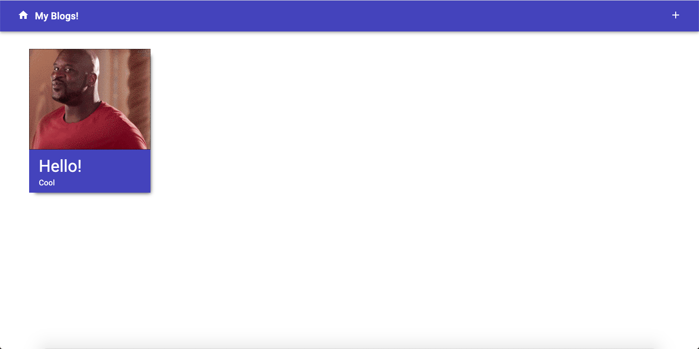
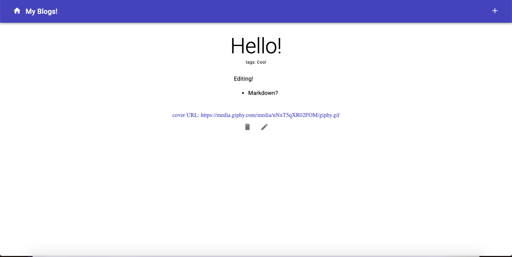
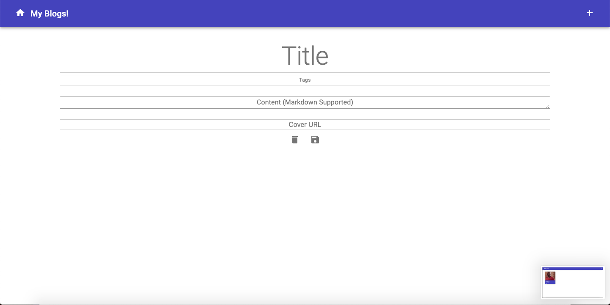

# Lab 4
## Alex Feng

## Description
This site was built using React, Yarn, Redux, and MongoDB (hosted via Heroku). This website is currently hosted on alexfeng-cs52-blog.surge.sh.
### What Worked
I was able to succesfully implement all the basic functionalities of the blog, such as all CRUD operations; routing for pages displaying all posts, creating a new post, and displaying the full details for a post; and Markdown support for the content. I was also able to use the Material-UI library for styling and managed to display a cover image only if a link was entered, though I didn't implement verification for the validity of links as cover images.

For authentication, I was able to create a conditional render that would prompt the user to sign out if they've been authenticated and would prompt the user to sign in otherwise. The user can also sign up, which is linked in the sign in page. Each post also displays the username of the post's creator. Also, only users that are logged in can modify, create, and delete posts. If the user is not logged in and attempts to create a post, they will be redirected to the sign-in page.
### What Didn't Work
I wasn't able to change the color theme for Material-UI, and I wasn't able to implement error handling in the event the API sends an error dispatch message. Additionally, I couldn't figure out how to style the posts page so that each post would fit into an evenly spaced grid, so I used a flexed row instead. I also couldn't figure out how to properly use the onBlur event, so I gave up on using clickable fields to edit/update a post.

I was not able to make the inputs on the sign-in and sign-up pages submit upon the user pressing "enter." I attempted to change their types to "submit," but this led to a strange input that did not allow for text entry. Additionally, I ran into styling issues with my sign-in and sign-up pages as I could not align the submit button along the right edge of the inputs. Additionally, I could not display the author of posts using Mongoose's populate method.
### Demo

Above is the home screen for the blogs. Each blog can also display a cover photo.

Above is an individual blog, which can be updated and deleted on this page. The blog content also supports Markdown.

Above is the page for creating a blog.